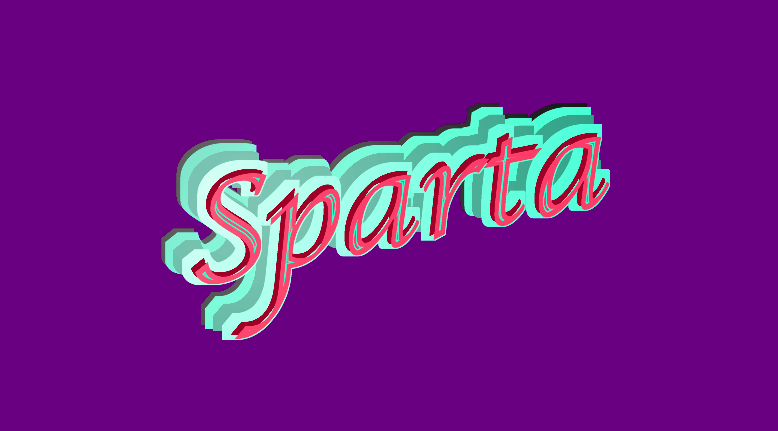
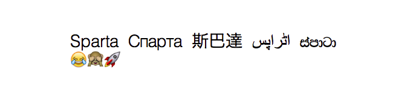
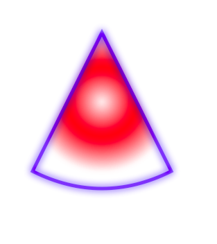

# Sparta [](https://travis-ci.org/syrel/Sparta)
Sparta is an almost stateless vector graphics API for Pharo that provides bindings to the Moz2D rendering backend. Moz2D is the extracted graphical engine from Mozilla Firefox compiled as standalone shared library together with the extern C bindings required to call the engine from Pharo.

### Documentation
  - [Canvas](src/Sparta-Core.package/SpartaCanvas.class/README.md)
  - [Paint](src/Sparta-Core.package/TSpartaPaint.trait/README.md)
    - [Gradient](src/Sparta-Core.package/TSpartaGradientPaint.trait/README.md)
      - [Linear](src/Sparta-Core.package/TSpartaLinearGradientPaint.trait/README.md)
      - [Radial](src/Sparta-Core.package/TSpartaRadialGradientPaint.trait/README.md)
    - [Surface](src/Sparta-Core.package/TSpartaSurfacePaint.trait/README.md)
  - [Fill](src/Sparta-Core.package/SpartaFillPainter.class/README.md)
  - [Stroke](src/Sparta-Core.package/SpartaStrokePainter.class/README.md)
  - [Path](src/Sparta-Core.package/TSpartaPathBuilder.trait/README.md)
  - [Clip](src/Sparta-Core.package/SpartaClipper.class/README.md)
  - [Text](src/Sparta-Core.package/SpartaTextPainter.class/README.md)
  - [Filter](src/Sparta-Core.package/SpartaFilterPainter.class/README.md)

### Install

Sparta requires extra [Moz2D](https://github.com/syrel/Moz2D) vm plugin. Plugin for the current OS and VM (32 or 64 bit) is downloaded and installed automatically together with all needed packages. For that, Sparta uses [Iceberg](https://github.com/npasserini/iceberg) to work with Git version control system. **Iceberg will be installed automatically if not yet present in the system.**

*Core packages:*
```smalltalk
Metacello new
  baseline: 'Sparta';
  repository: 'github://syrel/sparta/src';
  load
```
*Development version together with tests and additional Lint rules:*
```smalltalk
Metacello new
  baseline: 'Sparta';
  repository: 'github://syrel/sparta/src';
  load: #development
```

### Overview
*(All images are rendered using Sparta in Pharo)*



### Backends
Moz2D, and as result Sparta, has support of native OS graphic engines, as well as cross platform ones.

On all platforms Sparta provides support of [Cairo](https://cairographics.org) and [Skia](https://skia.org/). Additionally, high performant [CoreGraphics and CoreGraphics Accelerated](https://developer.apple.com/reference/coregraphics) on Mac OS and [Direct2D](https://msdn.microsoft.com/en-us/library/windows/desktop/dd317121(v=vs.85).aspx) on Windows.
In total Sparta supports 5 different rendering backends. 

### Text
One of the biggest improvements compared to existing graphics engines from Pharo is advanced high quality text rendering with multi-language support.



The current Pharo text rendering engines draw a piece of text with one concrete font and style. If the font does not have an appropriate character, a stub glyph will be rendered instead.
Sparta introduces a notion of font groups that allow us to achieve a smooth fallback font detection based on the selected font style, language and missing glyphs. Fallback font support requires more complex text measurement, as multiple fonts faces are involved to render a single piece of text.

### Filters
Since Sparta is based on the Moz2D backend that was designed for web browsers, we can get support for a wide variety of [filter primitives](https://www.w3.org/TR/SVG/filters.html). Sparta provides an ability to compose multiple filter primitives to get a single, advanced filter. For example, with the help of ColorMatrix and TableTransfer filters we can simulate some popular Instagram-like filters, for example Nashville, Inkwell or Brannan.


### Basic drawings
We should not forget that first of all Sparta is a vector graphics engine. It allows developers to create, fill and stroke custom paths and shapes. Together with gaussian blur, we can achieve astonishing results that were not possible before.


